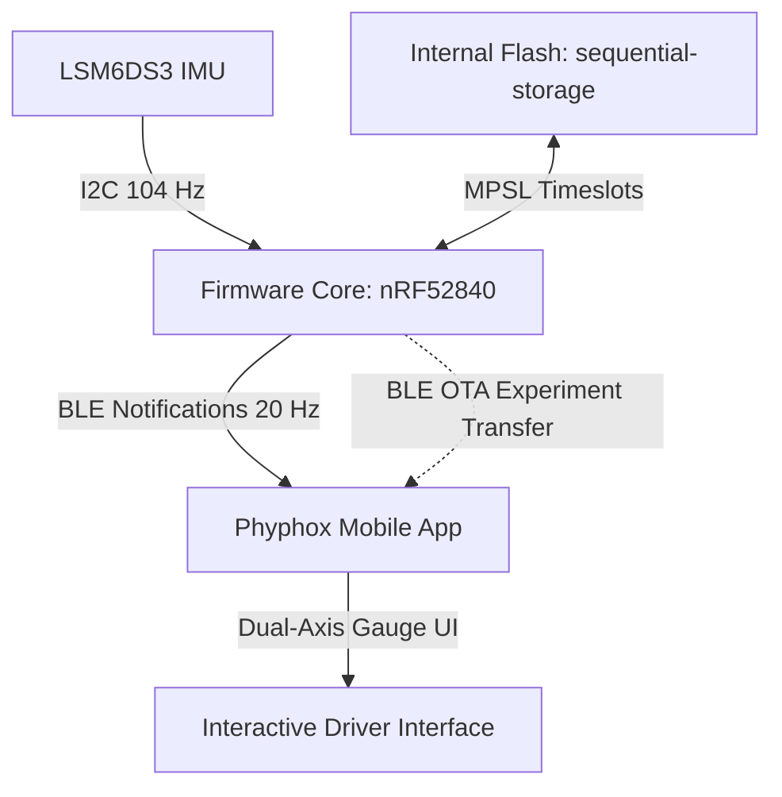
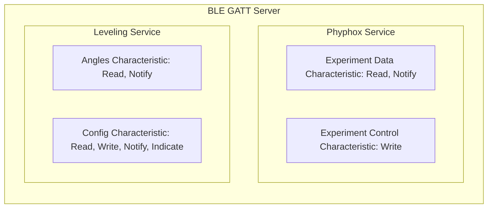

# System Architecture

This document describes the software architecture, data models, and implementation details for the **Leveler** firmware.

---

## 1. High-Level Architecture



The system operates as an asynchronous, event-driven embedded application powered by the `embassy` framework on a Nordic nRF52840 SoC.

---

## 2. Subsystem Architecture

### 2.1 IMU Driver Subsystem (`src/accelerometer.rs`)

- **Sensor Hardware:** STMicroelectronics LSM6DS3 6-axis IMU connected via I2C (`TWISPI1`).
- **Power Control:** Microcontroller pin `P1.08` controls power to the sensor circuit on the Seeed Studio XIAO BLE Sense board.
- **Configuration:**
  - `CTRL1_XL` (`0x10`) configured for 104 Hz Output Data Rate (ODR) and $\pm 2g$ measurement range.
  - `CTRL8_XL` (`0x17`) configured for standard accelerometer filtering.
- **Sampling:** Raw 16-bit linear acceleration data ($X, Y, Z$) is polled periodically every 50 ms (20 Hz).

---

### 2.2 Mathematical Coordinate Engine (`src/leveling.rs`)

The coordinate transformation engine converts raw accelerometer readings into vehicle pitch and roll angles based on arbitrary sensor mounting orientations.

#### Cardinal Vectors

Each direction index ($1..=6$) corresponds to a 3D unit vector in the vehicle coordinate frame:

| Index | Cardinal Direction | Unit Vector ($\hat{u}$) |
| :--- | :--- | :--- |
| `1` | Front | $[0, +1, 0]$ |
| `2` | Rear | $[0, -1, 0]$ |
| `3` | Left | $[-1, 0, 0]$ |
| `4` | Right | $[+1, 0, 0]$ |
| `5` | Up | $[0, 0, +1]$ |
| `6` | Down | $[0, 0, -1]$ |

#### Orthonormal Basis Vector Computation

The physical sensor coordinate alignment defines:
- **USB-C Port Axis:** $-\hat{X}_s$
- **Top Label Axis:** $+\hat{Z}_s$
- **Lateral Axis:** $+\hat{Y}_s = \hat{u}_{\text{usbc}} \times \hat{u}_{\text{top}}$

A mounting configuration is valid if and only if the dot product of $\hat{u}_{\text{usbc}}$ and $\hat{u}_{\text{top}}$ is zero (orthogonal). There are 24 valid orthonormal mounting orientations on a 3D cube.

#### Angle Calculation & Ball Physics

Raw acceleration vector $\vec{a}_{\text{raw}}$ is projected onto the basis vectors:

$$a_{\text{lat}} = \vec{a}_{\text{raw}} \cdot \hat{X}_s$$
$$a_{\text{long}} = \vec{a}_{\text{raw}} \cdot \hat{Y}_s$$
$$a_{\text{vert}} = \vec{a}_{\text{raw}} \cdot \hat{Z}_s$$

Angles are calculated using the 4-quadrant arctangent function (`libm::atan2f`):

$$\text{Pitch} = \text{atan2}(-a_{\text{long}}, \sqrt{a_{\text{lat}}^2 + a_{\text{vert}}^2}) \times \frac{180}{\pi} - \text{Pitch Offset}$$
$$\text{Roll} = \text{atan2}(-a_{\text{lat}}, a_{\text{vert}}) \times \frac{180}{\pi} - \text{Roll Offset}$$

Longitudinal acceleration is inverted to produce "ball physics": the crosshairs move toward the lower side of the vehicle.

---

### 2.3 Bluetooth Low Energy Subsystem (`src/bluetooth.rs`)

The firmware uses the `trouble-host` BLE stack and the Nordic `nrf-sdc` SoftDevice Controller over `nrf-mpsl`.



#### Phyphox Service (`cddf0001-30f7-4671-8b43-5e40ba53514a`)

Transfers the compressed experiment UI directly to the Phyphox app upon connection.

- **Experiment Control (`cddf0003-...`):** Writing byte `0x01` requests experiment transmission.
- **Experiment Data (`cddf0002-...`):**
  - **Header Packet (15 bytes):**
    - Bytes 0..7: ASCII string `phyphox\0`
    - Bytes 7..11: Experiment file size in bytes (big-endian `u32`)
    - Bytes 11..15: CRC32 checksum (big-endian `u32`)
  - **Data Packets:** Transmitted in sequential 20-byte chunks with 15 ms pacing intervals.

#### Leveling Service (`a0000001-4493-41db-9609-eb926bd307c7`)

- **Angles Characteristic (`a0000002-...`):** 8-byte payload streamed at 20 Hz.
  - Bytes 0..4: Pitch angle (float32 little-endian)
  - Bytes 4..8: Roll angle (float32 little-endian)
- **Config Characteristic (`a0000003-...`):** 26-byte configuration payload.

```
+---------------+---------------+-------------------+------------------+
| usbc_dir (1B) |  top_dir (1B) | pitch_offset (4B) | roll_offset (4B) |
+---------------+---------------+-------------------+------------------+
|  th_front(4B) |  th_rear (4B) |    th_left (4B)   |   th_right (4B)  |
+---------------+---------------+-------------------+------------------+
```

---

### 2.4 Non-Volatile Storage Subsystem (`src/storage.rs`)

- **Flash Range:** Dedicated 8 KB storage sector (`0x000FE000` to `0x00100000`) specified in `memory.x`.
- **Storage Engine:** `sequential-storage` map with wear leveling.
- **Timeslot Coordination:** Uses `nrf-mpsl::Flash` to schedule flash erase and write operations in hardware radio timeslots. This prevents flash operations from disrupting active BLE connections.
- **Write Mitigation:** Flash writes only execute when configuration values change. Operations retry up to 5 times with delay if the radio is busy.

---

### 2.5 Build-Time Compression Pipeline (`build.rs`)

- Compresses `leveler.phyphox` into a Deflate ZIP archive (`leveler.zip`) during compilation.
- The compressed payload is embedded into the firmware binary via `include_bytes!`.
- Generates linker configuration scripts for `probe-rs` and `defmt`.
