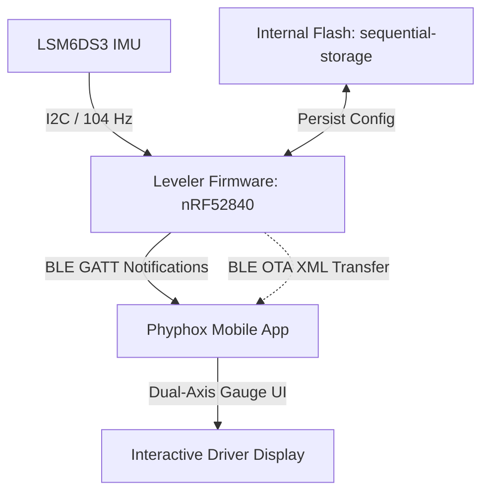

# Leveler

[](LICENSE)
[](https://www.rust-lang.org/)
[](https://embassy.dev/)

> Precise, zero-install campervan leveling firmware powered by Rust, BLE, and Phyphox.

**Leveler** is an asynchronous embedded firmware for the Nordic nRF52840 (Seeed Studio XIAO BLE Sense) and LSM6DS3 IMU. It turns your microcontroller into an intelligent leveling sensor that streams dual-axis crosshair visual data directly to your smartphone with zero app installation.

---

## Why Leveler?

- **Rust for Reliability:** Built with `no_std` Rust on the `embassy` asynchronous framework. It provides memory safety, deterministic execution, and zero runtime crashes.
- **Zero App Installation:** Uses the open-source **Phyphox** application. The firmware dynamically packages and transmits the complete interactive UI definition over BLE on connection.
- **Universal 24-Orientation Mounting:** Mount the sensor in any of the 24 orthogonal cube orientations to suit your USB-C cable routing. The dynamic vector engine calculates accurate vehicle pitch and roll automatically.
- **Persistent Flash Storage:** Stores orientation choices and zero-reference calibrations in non-volatile flash memory with wear leveling.
- **Ultra-Low Power:** Uses Bluetooth Low Energy (TrouBLE stack) with asynchronous sleep modes to preserve vehicle battery power.

---

## System Architecture



### Core Architecture Principles

1. **Self-Describing BLE Sensor:** The microcontroller stores the compressed Phyphox XML definition in flash and transfers it on demand over a custom GATT service.
2. **Dynamic Basis Vector Transformation:** Instead of fixed lookup tables, the system computes the 3D coordinate basis vectors ($X_s, Y_s, Z_s$) in real time from USB-C and Top Label selections.
3. **Low Side Indicator (Ball Physics):** The crosshair cursors move toward the lower side of the vehicle, matching intuitive leveling ramp positioning.

---

## Hardware Requirements

- **Microcontroller Board:** Seeed Studio XIAO BLE Sense (Nordic nRF52840 + LSM6DS3 IMU).
- **Power Supply:** 5V USB-C or 3.7V LiPo battery.
- **Mobile Device:** iOS or Android device with Bluetooth Low Energy and the free [Phyphox app](https://phyphox.org/).

---

## Quick Start

### 1. Prerequisites

- Install the [Rust toolchain](https://rustup.rs/) with the `thumbv7em-none-eabi` target:
  ```sh
  rustup target add thumbv7em-none-eabi
  ```
- Install [probe-rs](https://probe.rs/) for flashing and debugging:
  ```sh
  cargo install probe-rs-tools --locked
  ```

### 2. Build the Firmware

Compile the release binary. The build script automatically compresses `leveling.phyphox` into the binary:

```sh
cargo build --release
```

### 3. Flash to Microcontroller

Connect your Seeed Studio XIAO BLE Sense via SWD / USB debug probe and execute:

```sh
probe-rs run --chip nRF52840_xxAA --release
```

---

## Operation

1. **Launch Phyphox:** Open the Phyphox app on your smartphone.
2. **Scan for Leveler:** Tap the **+** button, select **Add experiment for Bluetooth device**, and select **Leveler**.
3. **Configure Orientation:**
   - Set **USB-C Port Points To** (Front, Rear, Left, Right, Up, Down).
   - Set **Top Label Points To** (Front, Rear, Left, Right, Up, Down).
4. **Set Zero Reference (Optional):** Park on a known level surface and tap **Set Level (Zero Reference)** to calibrate vehicle offsets.

---

## License

This project is dual-licensed under the MIT License and the Apache License (Version 2.0).
