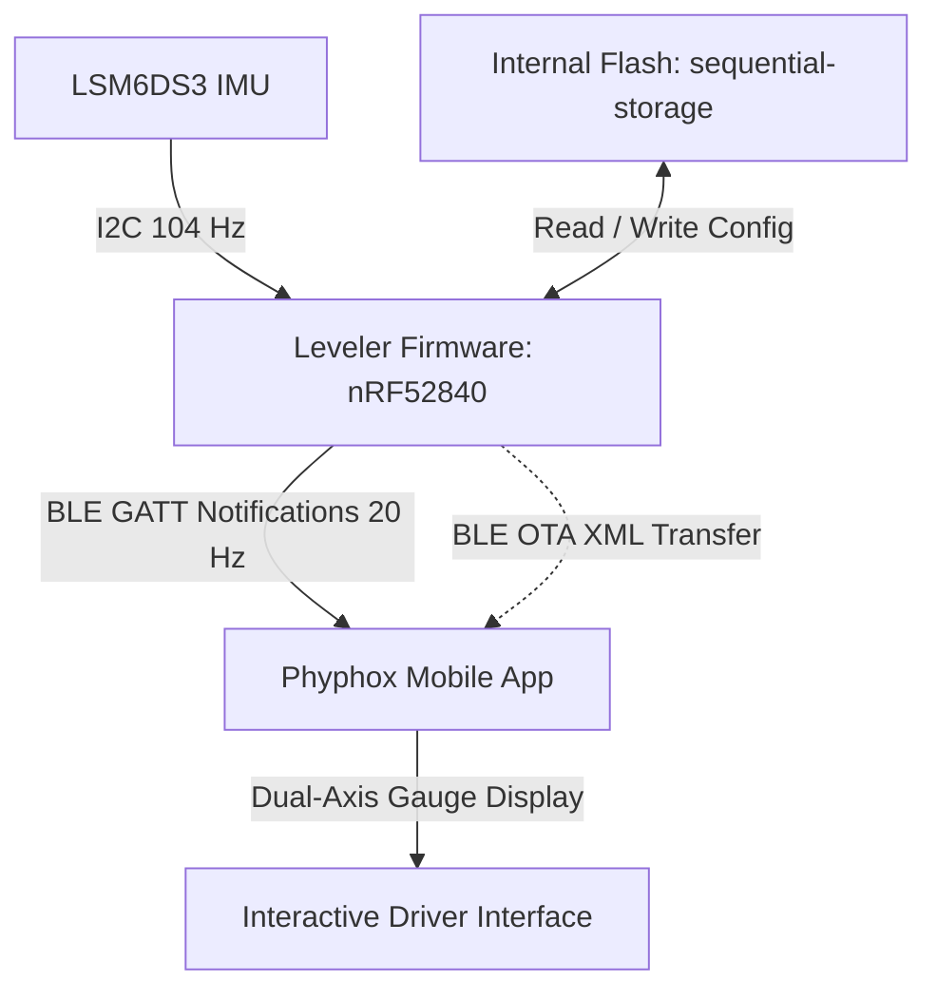

# Leveler

[](LICENSE)
[](https://www.rust-lang.org/)
[](https://embassy.dev/)

Embedded leveling firmware for campervans and vehicles. Powered by Rust, Bluetooth Low Energy (BLE), and the open-source Phyphox mobile application.

**Leveler** is an asynchronous embedded firmware for the Nordic nRF52840 microcontroller (Seeed Studio XIAO BLE Sense) and the integrated LSM6DS3 IMU. It operates as an intelligent leveling sensor that transfers an interactive dual-axis crosshair display directly to your smartphone with no custom app installation.

---

## Capabilities

- **Memory Safety and Reliability:** Built with `no_std` Rust on the asynchronous `embassy` framework.
- **Zero App Installation:** Uses the open-source **Phyphox** application. The firmware automatically compresses and transfers the full interactive experiment UI over BLE.
- **Universal 24-Orientation Mounting:** Mount the sensor in any of the 24 orthogonal orientations. The internal vector engine calculates accurate pitch and roll angles automatically.
- **Persistent Flash Storage:** Stores orientation configurations, zero-reference tare calibrations, and tolerance thresholds in non-volatile flash memory with wear leveling.
- **Low-Power Operation:** Uses the `trouble-host` BLE stack and asynchronous sleep modes to minimize power consumption.

---

## System Architecture



### Architectural Details

1. **Self-Describing BLE Sensor:** The microcontroller stores the compressed Phyphox XML definition in flash memory and transmits it on demand over the standard Phyphox GATT service.
2. **Dynamic Coordinate Transformation:** The system calculates 3D Cartesian basis vectors ($X_s, Y_s, Z_s$) in real time from the selected USB-C and Top Label directions.
3. **Low-Side Ball Physics:** The crosshair cursors move toward the lower side of the vehicle to match physical leveling ramp placement.
4. **Timeslot-Managed Storage:** Non-volatile flash read and write operations use MPSL timeslots to prevent disruption of active BLE radio connections.

---

## Hardware Requirements

- **Microcontroller Board:** Seeed Studio XIAO BLE Sense (Nordic nRF52840 with LSM6DS3 IMU).
- **Power Supply:** 5V USB-C or 3.7V lithium-polymer battery.
- **Mobile Device:** iOS or Android device with Bluetooth Low Energy and the free [Phyphox application](https://phyphox.org/).
- **Debug Probe:** SWD debug probe supported by probe-rs (such as J-Link, CMSIS-DAP, or ST-Link).

---

## Quick Start

### 1. Prerequisites

- Install the [Rust toolchain](https://rustup.rs/) with the `thumbv7em-none-eabi` target:
  ```sh
  rustup target add thumbv7em-none-eabi
  ```
- Install [probe-rs](https://probe.rs/) for flashing and runtime logs:
  ```sh
  cargo install probe-rs-tools --locked
  ```

### 2. Build and Flash Firmware

Connect your debug probe to the Seeed Studio XIAO BLE Sense SWD pins and run:

```sh
cargo run --release
```

The build script compresses `leveler.phyphox` into the binary automatically, flashes the target, and starts `defmt` logging.

---

## Operation

1. **Open Phyphox:** Start the Phyphox application on your mobile device.
2. **Scan for Sensor:** Tap the **+** button, choose **Add experiment for Bluetooth device**, and select **Leveler**.
3. **Configure Mounting Orientation:**
   - Set **USB-C Port Points To** (Front, Rear, Left, Right, Up, Down).
   - Set **Top Label Points To** (Front, Rear, Left, Right, Up, Down).
4. **Set Zero Reference (Optional):** Park the vehicle on a known level surface and tap **Set Level (Zero Reference)** to store offset calibration in flash memory.
5. **Set Tolerance Thresholds:** Adjust front, rear, left, and right threshold limits for visual level indicators.

---

## License

This project is dual-licensed under the MIT License and the Apache License (Version 2.0).
